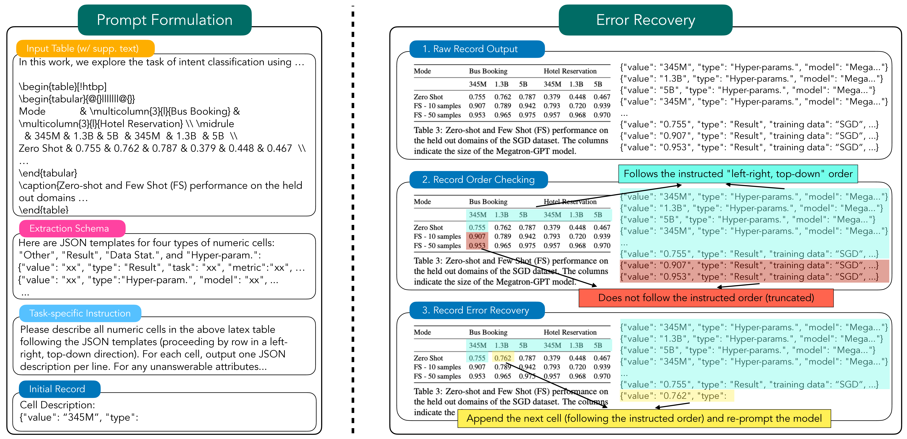

Schema-Driven Information Extraction from Heterogeneous Tables
===============================================================================

This repo contains code and data associated with the paper ["Schema-Driven Information Extraction from Heterogeneous Tables"](https://arxiv.org/abs/2305.14336).
```
@misc{bai2023schemadriven,
    title={Schema-Driven Information Extraction from Heterogeneous Tables},
    author={Fan Bai and Junmo Kang and Gabriel Stanovsky and Dayne Freitag and Alan Ritter},
    year={2023},
    eprint={2305.14336},
    archivePrefix={arXiv},
    primaryClass={cs.CL}
}
```

# Task: Schema-to-JSON


<!-- # Method: InstrucTE
 -->

# Installment

1. Create conda environment.
```
git clone https://github.com/bflashcp3f/schema-to-json.git
cd schema-to-json
conda env create -f environment.yml
conda activate s2j
```

2. Set up OpenAI API key with the environment variable `OPENAI_API_KEY`. If you want to use Azure, set up the environment variable `AZURE_API_KEY`.

3. Install from the source
```
pip install -e .
```

# Data
Four datasets (MlTables, ChemTables, DiSCoMat and SWDE) in our benchmark are available under the `data` directory.

# Experiments

Below are the commands to reproduce paper results. Make sure you set up `API_SOURCE` (`openai` or `azure`) and `BACKEND` (model name) in the script. For open-source models, use scripts with suffix `_os.sh`.


## MlTables

```
# Prompt (w/ error recovery)
bash scripts/mltables/prompt_error_recovery.sh

# Evaluation
bash scripts/mltables/eval.sh
```

## ChemTables

```
# Prompt (w/ error recovery)
bash scripts/chemtables/prompt_error_recovery.sh

# Evaluation
bash scripts/chemtables/eval.sh
```

## DiSCoMat

```
# Prompt
bash scripts/discomat/prompt_error_recovery.sh

# Evaluation
bash scripts/discomat/eval.sh
```


## SWDE

```
# Prompt
bash scripts/swde/prompt.sh

# Evaluation
bash scripts/swde/eval.sh
```

<!-- # TODO
- [ ] Add code for open-source models.
- [ ] Clean and upload pre-processing code. -->