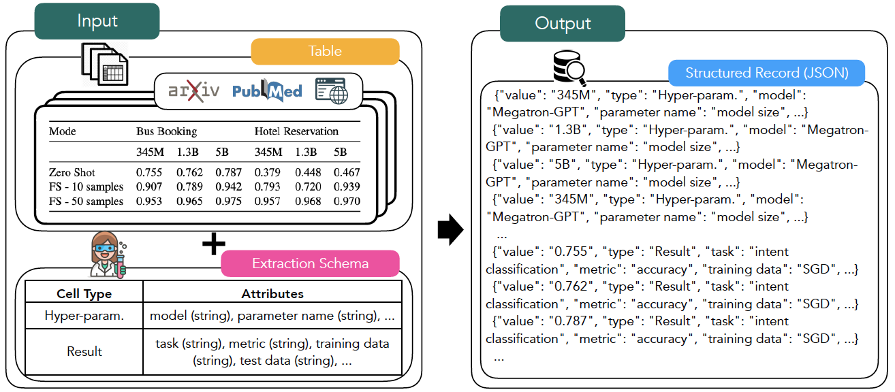
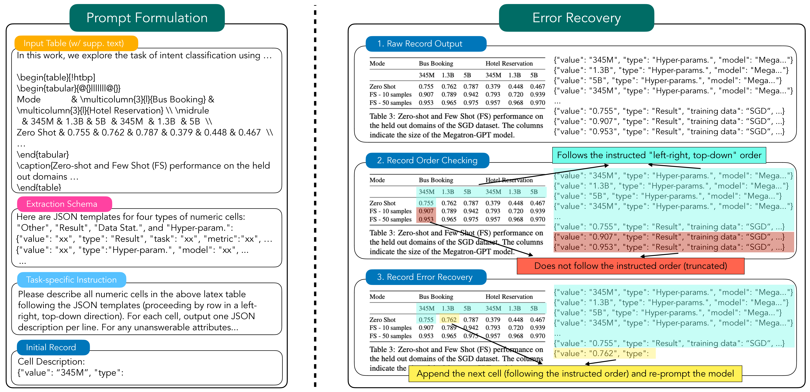

Schema-Driven Information Extraction from Heterogeneous Tables
===============================================================================

This repo contains code and data associated with the paper ["Schema-Driven Information Extraction from Heterogeneous Tables"](https://arxiv.org/abs/2305.14336).
```
@article{bai2023schemadriven,
    title={Schema-Driven Information Extraction from Heterogeneous Tables}, 
    author={Fan Bai and Junmo Kang and Gabriel Stanovsky and Dayne Freitag and Alan Ritter},
    journal={arXiv preprint arXiv:2305.14336},
    year={2023},
}
```

# Task: Schema-to-JSON




# Method: InstrucTE



# Code & Data
Coming soon.
